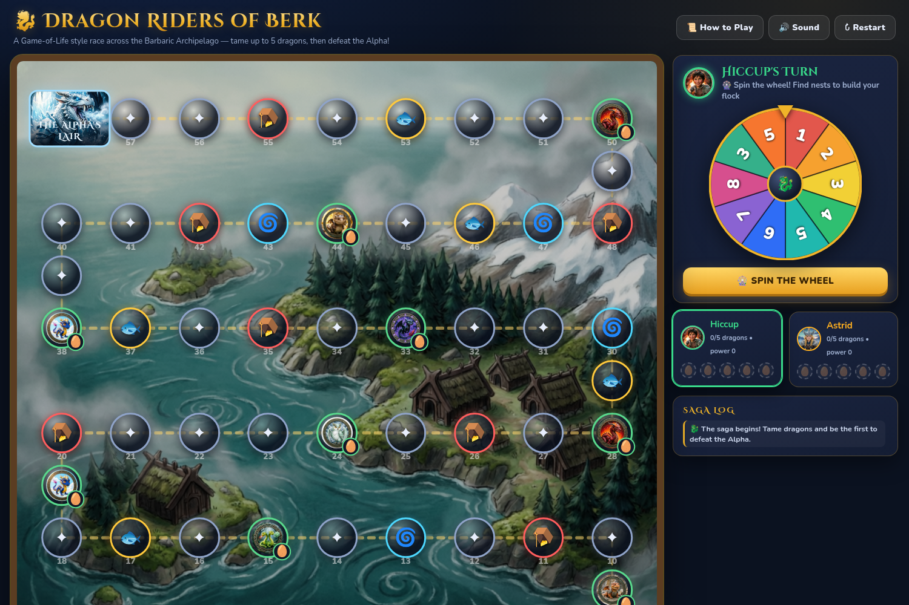

# 🐉 Dragon Riders of Berk

> A Game-of-Life style race across the Barbaric Archipelago — tame up to 5 dragons, then defeat the Alpha!

**🎮 Play it live: https://antonlapshin.github.io/dragon-riders-of-berk/**
**🧩 Component showcase: https://antonlapshin.github.io/dragon-riders-of-berk/?view=showcase**



A 2–3 player hot-seat board game for the browser, built with **React + TypeScript + Vite** using **Atomic Design**. Spin the wheel, race from **Berk Village** to **The Alpha's Lair**, build your dragon flock, and bring down the Glacial Tyrant. Choose **2 players (Hiccup vs Astrid)** or **3 players (Stoick joins the hunt)** on the setup screen.

This is a full refactor of the original single-file (`index.html`) game: same rules, same look, same sounds — now with zero code duplication, pure game-logic modules, reusable components, and a live component gallery.

---

## ✨ Features

- 🗺️ 59-tile serpentine board over a painted Barbaric Archipelago map
- 🎡 Animated spinning wheels (move wheel, taming wheel, battle wheel)
- 🥚 7 tamable dragons with unique art, species & power
- ⚔️ Final boss battle vs the Alpha with HP pips, plasma-blast crits & sound effects
- 🔊 Retro WebAudio sound (roars, clashes, fanfares — no audio files needed)
- 📜 In-game How-to-Play, saga log, turn skipping, extra turns, storm teleports
- 🧩 Component Showcase page with URL deep-linking (`?view=showcase&file=Button&showcase=Gold`)

## 🎯 Goal

Race from **Berk Village (tile 0)** to **The Alpha's Lair (tile 58)** along the winding path. Collect up to **5 dragons**, then defeat **The Alpha** in battle to win.

## 🎡 Your Turn — 3 Move Options

1. Press **SPIN THE WHEEL** (values 1–8).
2. Then choose one of three moves:
   - 🎡 **Go the wheel number forward** — free, the normal move.
   - 🐾 **Go 1 forward** — a careful nudge, but it **costs your next turn**.
   - 🐾 **Go 1 backward** — a daring retreat, but it **costs your next turn**.
3. Resolve the space you land on — every event asks you to confirm with **OK**.

## 🗺️ Spaces

| Tile | Effect |
|------|--------|
| 🛖 **Berk Village (start)** | Where every rider begins. |
| 🥚 **Dragon Nest — Taming Spin Challenge** | Spin the Taming Wheel: **CATCH** wins that dragon · **ESCAPES** drifts you back 2 · **NET TRAP** costs a turn · **CATCH+FEAST** also grants another spin. Revisiting an owned nest grants an extra spin. A full flock of 5 can't tame more. |
| 🐟 **Fish Feast** | Devour fish, full of energy — **spin again**! |
| 🪤 **Trapper Net** | Tangled in a net — **lose your next turn**. |
| 🌀 **Storm Vortex** | Ride the wind straight to the **next dragon nest**. |
| ✦ **Safe Skies** | Nothing happens, enjoy the view. |
| 🧊 **Alpha's Lair** | Arrive with **at least 1 dragon** and the battle begins. Arrive with **none** and the icy roar blasts you back **8 spaces**! |

## ⚔️ The Final Battle

Each round: **your spin + flock power + Rider's Courage (+6)** vs **Alpha's spin + 18**.

- Higher total lands a hit; ties do nothing.
- A natural **10** is a ⚡ **Plasma Blast (+6)** — so even a lone dragon has a slim chance!
- First to **3 hits** wins the game.
- Every dragon you collect makes victory far more likely.
- If the Alpha wins, your flock scatters: you **lose a random dragon** and are sent **all the way back to Berk Village**!

## 🐉 Dragon Codex

| Dragon | Species | Power |
|--------|---------|-------|
| Meatlug | Gronckle | ⚡2 |
| Grump | Gronckle | ⚡2 |
| Barf & Belch | Hideous Zippleback | ⚡3 |
| Stormfly | Deadly Nadder | ⚡3 |
| Cloudjumper | Stormcutter | ⚡4 |
| Hookfang | Monstrous Nightmare | ⚡4 |
| Toothless | Night Fury | ⚡5 |

---

## 🛠️ Development

```bash
npm install          # install dependencies
npm run dev          # start the dev server (http://localhost:5173)
npm test             # run unit tests (Vitest)
npm run test:coverage # unit tests with coverage (engine + utils at 100%)
npm run build        # type-check + production build into dist/
npm run preview      # preview the production build locally
```

## 🧠 Architecture — UI ⇒ Game Engine ⇒ Utils

All game rules live in the pure engine; the UI only animates, shows dialogs,
and feeds player choices back into it:

- **UI** (`src/components`, `src/hooks`, `src/lib`) — rendering, animation,
  sound, modal promises. Contains no rule decisions.
- **Game Engine** (`src/engine`, `src/core`) — every rule decision, 100%
  unit-tested, no React/DOM/sound/timers:
  - `src/engine/gameEngine.ts` — tile classification, taming outcomes,
    battle defeat, turn arbitration (`advanceTurn`), chained-walk helper.
  - `src/engine/battleEngine.ts` — Alpha-battle state machine.
  - `src/core/` — board path, battle math, wheel math, shared constants.
- **Utils** (`src/engine/utils.ts`, `src/utils`) — pure reusable helpers
  (clamping, step paths, player rotation, extra-vs-skip arbitration),
  also 100% unit-tested.

## 🧱 Project structure (Atomic Design)

```
src/
├── engine/        # pure rule decisions — no React, no DOM (unit-tested)
│   ├── gameEngine.ts   # tile tasks, taming/battle-defeat, turn arbitration
│   ├── battleEngine.ts # Alpha-battle state machine (HP, rounds, win/loss)
│   └── utils.ts        # pure helpers (clamp, step paths, rotation, advance)
├── core/          # pure game data + math — no React, no DOM (unit-tested)
│   ├── constants.ts  # dragons, artwork, board config, wheel segments
│   ├── board.ts      # serpentine 59-tile path, tile typing, nest lookup
│   ├── wheels.ts     # weighted picks + spin-target geometry
│   └── battle.ts     # flock power + battle-round math
├── utils/         # sleep() and other tiny pure helpers (unit-tested)
├── lib/           # sound engine (WebAudio singleton)
├── hooks/
│   └── useGame.ts    # full turn-loop state machine (view model)
├── components/
│   ├── atoms/        # Button, Chip, Avatar, Pip, Modal, CardTitle, Confetti
│   ├── molecules/    # Wheel, BoardTile, LairTile, PlayerToken, PlayerCard,
│   │                 # TurnHeader, HealthPips, SagaLog, LegendBar
│   ├── organisms/    # Board, TurnPanel, PlayersPanel, AppHeader,
│   │                 # EventModal, MoveChoiceModal, ChallengeModal,
│   │                 # BattleModal, HowToModal, WinModal
│   ├── templates/    # GameLayout
│   └── pages/        # GamePage, ShowcasePage
├── showcases/     # one `name` + variants per component file + registry
├── styles/        # global.css (ported 1:1 from the original game)
└── main.tsx / App.tsx  # entry + Game ⇄ Showcase routing (?view=showcase)

vendor/            # vendored `showcase` gallery library source (see vendor/VENDOR.md)
```

### 🧩 Showcase page

The gallery at `?view=showcase` is built on the
[`showcase`](https://github.com/AntonLapshin/showcase) library's `useShowcase`
view model: each file under `src/showcases/` exports a `name` constant plus one
component per variant, registered in `src/showcases/index.ts`. Selection,
sidebar expand/collapse and URL deep-linking (`?file=..&showcase=..`) all come
from the library's pure core engine. The library isn't published to npm yet, so
its source is vendored under `vendor/` (see `vendor/VENDOR.md`).

## 🌍 Deploy

This repo deploys to **GitHub Pages** via GitHub Actions (`.github/workflows/deploy-pages.yml`).
Every push to `main` runs tests, builds the Vite app (`dist/`, served under the
`/dragon-riders-of-berk/` base path), and publishes it to:

**https://antonlapshin.github.io/dragon-riders-of-berk/**
